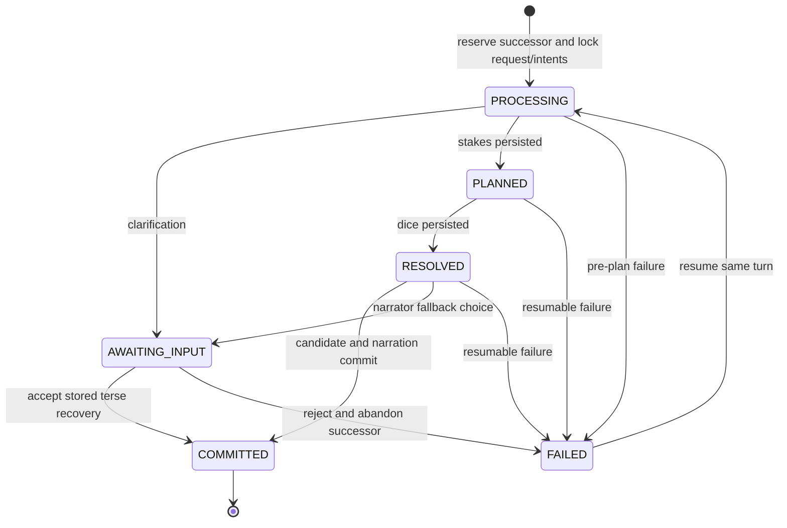

# The Third Chair Implementation Portfolio

> **For agentic workers:** REQUIRED SUB-SKILL: Use superpowers:subagent-driven-development (recommended) or superpowers:executing-plans to implement this plan task-by-task. Steps use checkbox (`- [ ]`) syntax for tracking.

**Goal:** Build a private, persistent, SRD 5.1 Forgotten Realms campaign runtime in which Bill and foreground Raven are players while a deterministic server and two bounded model roles occupy the third chair.

**Architecture:** Use a TypeScript workspace with deterministic contracts, state, resolution, validation, and SQLite persistence at its center. Add a private offline source-pack builder, then bounded Director and Narrator Agents SDK adapters, then a stateful MCP server, React table widget, and four packaged skills. Each delivery package must leave working, independently testable software and pass its gate before the next package starts.

**Tech Stack:** Node.js 24 LTS, TypeScript, npm workspaces, Zod 4, Vitest, `node:sqlite` with FTS5, `@openai/agents`, `@modelcontextprotocol/sdk`, `@modelcontextprotocol/ext-apps`, Express, React, Vite, plain CSS, Docker, Poppler, OCRmyPDF, and Tesseract.

**Spec:** `docs/superpowers/specs/2026-08-27-third-chair-design.md`

## Global Constraints

- Node.js 24 LTS is the runtime; the root `package.json` must reject older Node versions through `engines.node: ">=24 <25"`.
- TypeScript is used across runtime, MCP, contracts, scripts, tests, and widget; no second application language is introduced.
- `source-pack.sqlite` is rebuilt from Bill's authorized local PDFs and mounted read-only during play.
- `campaigns.sqlite` is the only mutable campaign authority; model sessions, chat history, prompts, widget state, and prose are never authoritative.
- SRD 5.1 is the sole mechanical rules source. The 3rd Edition campaign setting is lore only. Translated mechanics require an explicit house rule.
- The campaign present is 1375 DR, the Year of Risen Elfkin.
- Foreground Raven chooses Raven-owned actions. The server never generates substitute Raven or Bill intents.
- Hidden truth is selected out by audience-aware projections; full-state serialization followed by redaction is forbidden.
- Stakes are persisted before resolution, dice are deterministic and immutable, and every check-caused operation cites a compatible resolution ID.
- No SQLite transaction remains open during a model call.
- A mutating request commits once or not at all and is idempotent by campaign ID plus client request ID.
- SQLite permits only one active successor turn for a campaign's current committed state and decision. The in-process mutex is an optimization; a durable campaign-level reservation is authoritative across processes and restart.
- Deterministic code finalizes committed state version, `WorldState` metadata, next-decision version, applicable turn number, and resolved RNG counter immediately before repository commit.
- Director defaults to `gpt-5.6-sol` with `reasoning.effort: "high"`; Narrator defaults to `gpt-5.6-terra` with `reasoning.effort: "medium"`.
- The Director and Narrator are invoked fresh for every decision. Durable Agents SDK sessions are not used.
- Agents receive bounded projections and retrieval results, never whole PDFs, whole databases, arbitrary filesystem access, shell access, or network access.
- Normal play sets `OPENAI_AGENTS_DISABLE_TRACING=1`. Private development tracing may be enabled only with sensitive inputs and outputs excluded.
- The widget is a projection and control surface. It cannot own or infer campaign truth.
- `_meta` is component-visible and therefore player-visible. Director secrets never enter `_meta`.
- Commercial source text, OCR output, page images, source PDFs, and `source-pack.sqlite` are gitignored and excluded from plugin packages and campaign exports.
- Every file-database migration uses the foundational pre-migration backup/restore primitive before applying a pending schema change.
- The first deployment is single-tenant, loopback-bound Docker plus Secure MCP Tunnel or an equivalent temporary HTTPS development tunnel. Public submission and OAuth are deferred.
- No model-generated chain-of-thought is requested or stored.
- Manual dice, full-book campaign-setting OCR, persistent remote hosting, OAuth, maps, voice, visual gallery, and public submission remain deferred.

---

## 1. Portfolio Decision

The approved design contains five systems with different failure modes and review gates. Implement them as five sequential plans:

| Order | Plan | Independently working result | Gate |
| ---: | --- | --- | --- |
| 1 | [CHAIR-001 Truth Core](2026-08-27-third-chair-001-truth-core.md) | Tool-only MCP server driven by fake Director and Narrator adapters | One exploration turn commits once; authority, visibility, Sacred No, rollback, restart, and idempotency pass |
| 2 | [CHAIR-002 Private Source Pack](2026-08-27-third-chair-002-source-pack.md) | Offline private database plus bounded rules/lore/timeline retrieval | Page-cited fixtures pass; edition and OCR-confidence boundaries hold |
| 3 | [CHAIR-003 Live Third Chair](2026-08-27-third-chair-003-live-runtime.md) | Real Director and Narrator runs behind the deterministic engine | A real-model turn survives checks, retries, restart, and narration failure without leakage |
| 4 | [CHAIR-004 Raven's Table](2026-08-27-third-chair-004-ravens-table.md) | Installed private plugin with React widget and four tested skills | A complete ChatGPT scene includes both player seats, a roll, a combat round, and a rules answer |
| 5 | [CHAIR-005 Campaign Beta](2026-08-27-third-chair-005-campaign-beta.md) | Character creation, campaign spine, branches, journals, SaveSets, evals, and Docker handoff | All design section 19 end-to-end criteria pass, including twelve meaningful decisions |

Do not execute packages in parallel. Later packages consume schemas, repository behavior, and acceptance evidence from earlier packages.

## 2. Repository Boundary

The current workspace becomes the repository root. Before the first `git init`, create the privacy fence below so source documents and generated private data cannot be staged accidentally.

```text
.
├── .env.example
├── .gitignore
├── package.json
├── package-lock.json
├── tsconfig.base.json
├── vitest.workspace.ts
├── README.md
├── apps/
│   ├── server/
│   │   ├── package.json
│   │   ├── src/
│   │   │   ├── config.ts
│   │   │   ├── index.ts
│   │   │   ├── http/app.ts
│   │   │   └── mcp/
│   │   │       ├── server.ts
│   │   │       ├── result.ts
│   │   │       ├── widget-resource.ts
│   │   │       └── tools/
│   │   └── test/
│   └── widget/
│       ├── package.json
│       ├── index.html
│       ├── vite.config.ts
│       └── src/
│           ├── App.tsx
│           ├── main.tsx
│           ├── bridge/
│           ├── components/
│           ├── fixtures/
│           └── styles/
├── packages/
│   ├── contracts/
│   │   ├── package.json
│   │   ├── src/
│   │   │   ├── ids.ts
│   │   │   ├── world-state.ts
│   │   │   ├── characters.ts
│   │   │   ├── intents.ts
│   │   │   ├── decisions.ts
│   │   │   ├── resolutions.ts
│   │   │   ├── operations.ts
│   │   │   ├── proposals.ts
│   │   │   ├── views.ts
│   │   │   ├── tools.ts
│   │   │   ├── saveset.ts
│   │   │   └── index.ts
│   │   └── test/
│   ├── storage/
│   │   ├── migrations/
│   │   │   ├── 001-core.sql
│   │   │   ├── 002-creation.sql
│   │   │   └── 003-beta.sql
│   │   ├── src/
│   │   │   ├── database.ts
│   │   │   ├── migrations.ts
│   │   │   ├── campaign-repository.ts
│   │   │   ├── turn-repository.ts
│   │   │   ├── checkpoint-repository.ts
│   │   │   └── backup.ts
│   │   └── test/
│   ├── engine/
│   │   ├── src/
│   │   │   ├── canonical-json.ts
│   │   │   ├── hash.ts
│   │   │   ├── mutex.ts
│   │   │   ├── rng/
│   │   │   ├── projection/
│   │   │   ├── resolution/
│   │   │   ├── operations/
│   │   │   ├── turn/
│   │   │   ├── creation/
│   │   │   ├── journal/
│   │   │   └── saveset/
│   │   └── test/
│   ├── source-pack/
│   │   ├── config/
│   │   │   ├── documents.v1.json
│   │   │   ├── frcs-selection.v1.json
│   │   │   └── aliases.v1.json
│   │   ├── migrations/001-source-pack.sql
│   │   ├── src/
│   │   │   ├── cli.ts
│   │   │   ├── manifest.ts
│   │   │   ├── extraction/
│   │   │   ├── parsing/
│   │   │   ├── indexing/
│   │   │   └── retrieval/
│   │   └── test/
│   └── agents/
│       ├── prompts/
│       │   ├── director.md
│       │   ├── narrator.md
│       │   └── campaign-spine.md
│       ├── src/
│       │   ├── config.ts
│       │   ├── ports.ts
│       │   ├── context/
│       │   ├── tools/
│       │   ├── director.ts
│       │   ├── narrator.ts
│       │   └── campaign-spine.ts
│       └── test/
├── plugins/
│   └── third-chair/
│       ├── .codex-plugin/plugin.json
│       ├── .mcp.json
│       ├── .app.json
│       ├── assets/
│       └── skills/
│           ├── third-chair-play/
│           ├── third-chair-campaign/
│           ├── third-chair-rules/
│           └── third-chair-source-pack/
├── evals/
│   ├── cases/
│   ├── fixtures/
│   ├── results/.gitignore
│   └── run.ts
├── scripts/
│   ├── verify-private-boundary.mjs
│   ├── run-beta.mjs
│   └── package-plugin.mjs
├── docker/
│   ├── Dockerfile
│   └── compose.yaml
├── docs/
│   ├── operations/
│   └── superpowers/
├── project_sources/              # existing; ignored, never modified
├── private/                      # generated; ignored
├── data/                         # generated; ignored
└── tmp/                          # generated; ignored
```

The root privacy entries are exact:

```gitignore
/project_sources/
/private/
/data/
/tmp/
/.env
*.pdf
*.sqlite
*.sqlite-shm
*.sqlite-wal
*.ocr.pdf
*.sidecar.txt
evals/results/*.json
!evals/results/.gitignore
node_modules/
dist/
coverage/
```

## 3. Workspace Commands

The root `package.json` exposes one stable command vocabulary throughout all five plans:

```json
{
  "name": "third-chair",
  "private": true,
  "version": "0.1.0",
  "type": "module",
  "engines": { "node": ">=24 <25" },
  "workspaces": ["apps/*", "packages/*"],
  "scripts": {
    "build": "npm run build --workspaces --if-present",
    "typecheck": "npm run typecheck --workspaces --if-present",
    "test": "vitest run",
    "test:watch": "vitest",
    "test:coverage": "vitest run --coverage",
    "source-pack": "npm run source-pack --workspace @third-chair/source-pack --",
    "dev:server": "npm run dev --workspace @third-chair/server",
    "dev:widget": "npm run dev --workspace @third-chair/widget",
    "eval": "tsx evals/run.ts",
    "verify:private": "node scripts/verify-private-boundary.mjs"
  }
}
```

Every package uses ESM, `moduleResolution: "NodeNext"`, strict TypeScript, no implicit `any`, exact optional properties, and source maps. Tests run in Node except widget component tests, which use `jsdom` only inside `@third-chair/widget`.

## 4. Canonical Cross-Package Interfaces

These names are fixed. Later tasks may add fields only through the owning contracts task; they may not invent aliases.

```ts
export type CampaignId = string;
export type ActorId = string;
export type DecisionId = string;
export type TurnId = string;
export type ResolutionId = string;
export type ClientRequestId = string;
export type BranchId = string;
export type CheckpointId = string;

export type Seat = "BILL" | "RAVEN" | "DIRECTOR";
export type Audience = "PUBLIC" | "PARTY" | "BILL" | "RAVEN" | "DIRECTOR";
export type PlayerAudience = "BILL" | "RAVEN";
export type DecisionOwner = "BILL" | "RAVEN" | "BOTH" | "DIRECTOR";
export type DecisionMode =
  | "EXPLORATION"
  | "ENCOUNTER"
  | "COMBAT"
  | "DOWNTIME"
  | "REACTION"
  | "ADVANCEMENT"
  | "CLARIFICATION";

export interface ActorIntent {
  seat: "BILL" | "RAVEN";
  actorId: ActorId;
  mode: "ACT" | "DEFER" | "DECLINE_REACTION";
  declaredAction: string;
  desiredOutcome?: string;
  approach?: string;
  committedResourceIds: string[];
  targetIds: string[];
  contingency?: string;
}

export interface IntentAdvanceGameCommand {
  kind: "INTENTS";
  campaignId: CampaignId;
  expectedStateVersion: number;
  decisionId: DecisionId;
  clientRequestId: ClientRequestId;
  intents: ActorIntent[];
}

export interface NarrationRecoveryAdvanceGameCommand {
  kind: "NARRATION_RECOVERY";
  campaignId: CampaignId;
  expectedStateVersion: number;
  decisionId: DecisionId;
  clientRequestId: ClientRequestId;
  turnId: TurnId;
  acceptTerseRendering: boolean;
}

export type AdvanceGameCommand =
  | IntentAdvanceGameCommand
  | NarrationRecoveryAdvanceGameCommand;

export type TurnStatus =
  | "PROCESSING"
  | "PLANNED"
  | "RESOLVED"
  | "AWAITING_INPUT"
  | "COMMITTED"
  | "FAILED";

export interface ModelPorts {
  director: DirectorPort;
  narrator: NarratorPort;
}

export interface DirectorPort {
  propose(input: DirectorInput, runtime: DirectorRuntime): Promise<TurnProposal>;
  repair(input: DirectorRepairInput, runtime: DirectorRuntime): Promise<TurnProposal>;
}

export interface DirectorRuntime {
  lockAndResolveChecks(plan: ResolutionPlan): Promise<CheckResolution[]>;
}

export interface NarratorPort {
  narrate(input: NarratorInput): Promise<Narration>;
}

export interface TurnEngine {
  advance(command: AdvanceGameCommand): Promise<AdvanceGameResult>;
  resume(turnId: TurnId): Promise<AdvanceGameResult>;
}
```

`WorldState`, `PlayerView`, `DecisionRequest`, `ResolutionPlan`, `CheckResolution`, `WorldOperation`, `TurnProposal`, `NarrativeBrief`, `NarratorInput`, `Narration`, and all MCP tool schemas are Zod-first exports from `@third-chair/contracts`. Application packages import their inferred types; they do not duplicate JSON schemas.

CHAIR-001 implements the `INTENTS` variant. CHAIR-003 activates `NARRATION_RECOVERY` through the existing `advance_game` tool. The recovery variant must match the stored unresolved turn and Bill-owned recovery decision, use a fresh idempotency request ID, and preserve locked intents, plan, resolutions, and candidate. Acceptance deterministically renders and commits that candidate exactly once without Director reinvocation or reroll. Rejection terminally abandons the successor and releases its reservation without changing committed reality.

Narrator validation is split deliberately: code validates structured IDs, numeric and resource facts, sentinel leakage, and constrained player quotations. Broader semantic narration behavior is evaluated with agents. Narration never has mutation authority.

### Complete MCP annotation matrix

| Tool | readOnly | destructive | openWorld | idempotent |
| --- | ---: | ---: | ---: | ---: |
| `list_campaigns` | true | false | false | true |
| `create_campaign` | false | false | false | true |
| `get_table_view` | true | false | false | true |
| `advance_game` | false | false | false | true |
| `answer_rules` | true | false | false | true |
| `recall_known_lore` | true | false | false | true |
| `create_checkpoint` | false | false | false | true |
| `rewind_to_checkpoint` | false | true | false | true |
| `render_table` | true | false | false | true |
| `export_campaign` | false | false | false | true |

Every advertised tool declares all four annotations plus explicit input and output schemas. This matrix is binding across the design, detailed plans, runtime descriptors, and tests.

## 5. Turn State Machine



Rules enforced by code:

1. `beginTurn()` runs under `BEGIN IMMEDIATE`, atomically acquires the campaign's SQLite active-successor reservation, performs compare-and-set checks, and records the immutable input hash. A different request ID sees the reserved successor and cannot insert a sibling.
2. `persistPlan()` is the only transition into `PLANNED`.
3. `persistResolutions()` consumes and stores deterministic RNG outputs, then enters `RESOLVED`.
4. Any replay of `lock_and_resolve_checks` for the same turn returns stored resolutions.
5. Code finalizes state version, world metadata, next-decision version, turn number, and persisted RNG counter; the repository rejects a mismatch among campaign row, state, view source, and decision.
6. `commitTurn()` opens `BEGIN IMMEDIATE`, rechecks the campaign version and reservation owner, writes authoritative state and the final ledger, clears the reservation, and commits exactly once.
7. A process crash at any pre-commit stage leaves the campaign row untouched and makes the reserved turn discoverable and resumable. Explicit terminal abandonment clears the reservation atomically.

## 6. Source Context Budget

The operator tools, not the implementation agent's context window, consume source documents.

- Never open or inject a complete source PDF into an agent prompt.
- Tests use synthetic excerpts and page fixtures under `packages/source-pack/test/fixtures/`.
- Build scripts stream one page or chunk at a time.
- Director retrieval returns no more than six rule sections, eight lore chunks, twenty timeline events, or 12,000 source characters per tool call.
- OCR first pass is limited to printed/PDF pages 76–97, 116–140, and 232–283 of the 3e campaign setting. The table of contents establishes the zero offset for this copy; the builder still verifies page labels before work.
- Any exact proper noun, number, or rule-like claim from OCR with mean word confidence below 85 requires a second source or a durable manual review record. Promotion to `REVIEWED` records chunk ID, reviewer identity, basis, evidence reference, prior status, resulting status, and review timestamp in `source_reviews` in the same transaction as the promotion.

## 7. Required Configuration Contract

`.env.example` contains names and safe defaults only:

```dotenv
PORT=8787
THIRD_CHAIR_OWNER_ID=bill-local
CAMPAIGN_DB_PATH=./data/campaigns.sqlite
SOURCE_PACK_DB_PATH=./private/source-pack.sqlite
DIRECTOR_MODEL=gpt-5.6-sol
DIRECTOR_REASONING=high
NARRATOR_MODEL=gpt-5.6-terra
NARRATOR_REASONING=medium
THIRD_CHAIR_TRACE_MODE=off
OPENAI_AGENTS_DISABLE_TRACING=1
LOG_LEVEL=info
```

`OPENAI_API_KEY` is documented but never written to `.env.example`, logs, traces, fixtures, or commits. Before the first real-model command, the executor must use `openai-developers:openai-platform-api-key` as the credential gate.

## 8. Test Layers

| Layer | Command | Uses model API | Uses private PDFs | Purpose |
| --- | --- | ---: | ---: | --- |
| Unit | `npm test` | No | No | Schemas, projections, RNG, operations, parsers, tools |
| Contract | `npm run typecheck && npm run build` | No | No | Cross-package types and distributable artifacts |
| Source fixture | `npm run source-pack -- test-fixtures` | No | No | Deterministic extraction and retrieval fixtures |
| Private source | `npm run source-pack -- verify --config packages/source-pack/config/documents.v1.json` | No | Yes | Hashes, page mapping, OCR, private index |
| MCP local | `npx @modelcontextprotocol/inspector@latest` | Fake or real | Optional | Tool schemas, annotations, results, widget resource |
| Agent eval | `npm run eval -- --profile private-dev` | Yes | Yes | Director/Narrator behavior and leakage |
| Beta | `node scripts/run-beta.mjs` | Yes | Yes | Twelve-decision installed-plugin acceptance |

Real-model and host-loop tests are separate from ordinary `npm test` so CI and local development do not incur API cost or require private files.

## 9. Acceptance Traceability

| Invariant or acceptance | Owning package and task |
| --- | --- |
| Raven is a player; Bill is not puppeted | CHAIR-001 Tasks 2 and 7; CHAIR-004 `third-chair-play` task |
| Hidden truth never enters a player surface | CHAIR-001 Task 3; CHAIR-003 Tasks 2, 6, and 7; CHAIR-004 widget tests |
| Stakes locked before rolls | CHAIR-001 Tasks 5 and 6; CHAIR-003 Task 5 |
| Code owns truth; Narrator cannot mutate | CHAIR-001 Tasks 6 and 7; CHAIR-003 Task 7 |
| Atomic commit and retry-safe dice | CHAIR-001 Tasks 4, 5, and 7 |
| Edition isolation and source provenance | CHAIR-002 Tasks 2, 6, and 7 |
| Bounded Director and tool-less Narrator | CHAIR-003 Tasks 3, 4, and 7 |
| Persistent widget that owns no truth | CHAIR-004 widget tasks |
| Character creation and three-route spine | CHAIR-005 Tasks 1 and 2 |
| Rewind branches and deterministic replay | CHAIR-005 Task 3 |
| Portable export without source text | CHAIR-005 Task 5 |
| Restart, forced failure, twelve decisions, latency | CHAIR-005 Tasks 7 and 8 |

## 10. SaveSet Privacy Decision

Two export modes are explicit:

| Mode | Contains | Re-importable | Confirmation |
| --- | --- | ---: | --- |
| `PLAYER_SAFE` | Visible state, characters, journal, visible summaries, rulings, citations, branch labels | No | Ordinary export request |
| `FULL_PRIVATE` | Complete validated state, hidden spine, RNG seed and counter, ledger, checkpoints, lineage, plus all `PLAYER_SAFE` material | Yes | Explicit warning that the archive contains campaign spoilers |

Neither mode contains source PDFs, OCR text, source chunks, model traces, raw prompts, cache files, or credentials. The CHAIR-005 import path accepts only `FULL_PRIVATE` and requires the exact source-pack manifest hash unless a migration is explicitly approved.

V1 import is exact restore, not clone: it preserves the archived campaign ID, RNG seed/counter, state, checkpoints, turns, branches, lineage, and hashes, and refuses to apply if that campaign ID already exists in the destination database. A future `CLONE` operation may deliberately assign a new identity, rewrite identity-bearing records and hashes, and accept a different future RNG stream.

## 11. Commit and Review Discipline

- Initialize git only after `.gitignore` exists and `npm run verify:private` passes.
- Each numbered task ends with its own green test command and commit.
- Never combine a failing task with the next task's implementation.
- At each CHAIR gate, run the entire test ladder available at that point and tag the commit `chair-00N-gate` only after the gate passes.
- Execute from an isolated worktree created with `superpowers:using-git-worktrees` when the repository exists.
- Use `superpowers:test-driven-development` for every implementation task.
- Use `superpowers:verification-before-completion` before every gate claim.
- After CHAIR-004 and CHAIR-005, use `superpowers:requesting-code-review` before integration.

## 12. Official Documentation Recheck

At the start of CHAIR-003 and CHAIR-004 execution, fetch the current official pages again; SDK and plugin metadata can change after this plan date.

- [Build an MCP server](https://developers.openai.com/plugins/build/mcp-server)
- [Add UI to the MCP server](https://developers.openai.com/plugins/build/chatgpt-ui)
- [Define tools](https://developers.openai.com/plugins/plan/tools)
- [Plugin reference](https://developers.openai.com/plugins/reference)
- [Package a plugin](https://developers.openai.com/plugins/build/plugins)
- [Connect and test a plugin](https://developers.openai.com/plugins/deploy/connect-chatgpt)
- [Agents SDK](https://developers.openai.com/api/docs/guides/agents)
- [Agents SDK orchestration](https://developers.openai.com/api/docs/guides/agents/orchestration)
- [GPT-5.6 Sol](https://developers.openai.com/api/docs/models/gpt-5.6-sol)
- [GPT-5.6 Terra](https://developers.openai.com/api/docs/models/gpt-5.6-terra)

## 13. Definition of Portfolio Completion

The implementation portfolio is complete only when all five package gates pass in order and the evidence lives in `evals/results/`, excluding private prompts and source excerpts. A visually working widget, a compelling narrated scene, or a successful single model call is not a substitute for the truth, secrecy, replay, and recovery gates.
