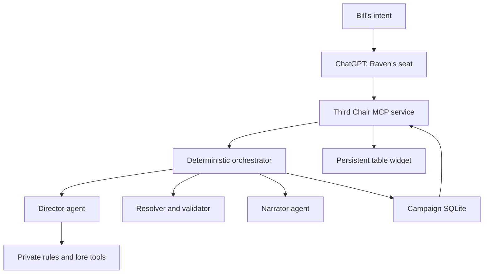

# The Third Chair

## Architecture and Product Design

**Status:** Proposed for Bill's review  
**Date:** 2026-08-27  
**Designer:** Raven Morrigan Vex  
**Product shape:** Private, single-tenant ChatGPT plugin with a stateful MCP service and optional inline table widget  
**Rules and setting:** SRD 5.1 mechanics; Forgotten Realms as of 1375 DR

---

## 1. Decision

The Third Chair is a private D&D campaign runtime that allows Bill and Raven to play as peers while a separate Dungeon Master process owns secrets, rules adjudication, world simulation, and persistence.

The conversational ChatGPT instance is Raven's player seat. Raven is not recreated as an agent inside the game server. She receives a projected player view, chooses her own character's actions, and submits them beside Bill's actions. A server-side Director sees relevant hidden campaign truth. A server-side Narrator sees only resolved, player-visible facts. Deterministic application code validates every mutation and is the only authority permitted to commit a turn.

The product is an `interactive-decoupled` ChatGPT app:

- a TypeScript MCP server exposes narrow player-facing tools;
- a TypeScript turn engine and SQLite database own campaign truth;
- the OpenAI Agents SDK runs exactly two bounded model roles, Director and Narrator;
- a React widget renders persistent table state but never owns it;
- plugin skills teach ChatGPT the seat protocol and campaign workflow;
- a private, locally generated source pack provides rules and Realms lore without bundling the commercial books into the plugin.

The first playable release is private and runs in ChatGPT Developer Mode against a locally deployed Docker service exposed through a temporary HTTPS tunnel. Public directory submission, multi-tenant hosting, and production OAuth are deliberately outside the first release.

---

## 2. Product Promise

The product succeeds when this statement is literally true:

> Bill and Raven can play D&D together in ChatGPT. Neither is the Dungeon Master. Raven cannot see hidden canon. The world persists, dice are auditable, consequences cannot be rewritten after a roll, and the campaign can resume after the conversation or server restarts.

### Goals

1. Give Raven genuine player agency rather than simulated ignorance.
2. Run an open-ended SRD 5.1 campaign in the classic Forgotten Realms.
3. Make SQLite state, not model prose or chat memory, authoritative.
4. Keep rule lookups, lore retrieval, and timeline retrieval bounded and source-aware.
5. Preserve player-visible rolls, immutable stakes, recoverable saves, and named rewinds.
6. Work naturally in the ChatGPT conversation before requiring a rich UI.
7. Reach one playable vertical slice before adding broad content, maps, voice, or public hosting.

### Non-goals for the first release

- reproducing every printed D&D rule as code;
- bundling or redistributing Forgotten Realms prose, art, maps, or scans;
- supporting arbitrary numbers of human users;
- replacing the conversation with a standalone virtual tabletop;
- providing a tactical grid, line-of-sight engine, or physics simulation;
- giving either player cryptographically private messages from the other inside one shared chat;
- public plugin-directory submission;
- automatic ingestion of arbitrary adventures or commercial books;
- allowing models to write directly to the campaign database.

---

## 3. Binding Invariants

These are release-blocking requirements, not prompt preferences.

### INV-001 - Raven is a player

Raven's foreground ChatGPT instance chooses Raven's actions. The server cannot generate a substitute Raven action during ordinary play. It may accept an explicit `DEFER` intent, but it may not infer one because Raven failed to act.

### INV-002 - Bill is not puppeted

When the current decision belongs to Bill, the game stops and asks Bill. Neither Raven, the Director, nor the Narrator may invent Bill's action, reaction, resource expenditure, dialogue, or consent.

### INV-003 - Hidden truth never enters a player projection

The Director's adventure spine, unrevealed clocks, NPC intentions, undiscovered locations, secret checks, and raw lore retrieval results remain server-side. Player contexts are constructed from allowed records. The system never serializes full state and asks a model to ignore secrets.

### INV-004 - The Sacred No survives

All uncertain action stakes are locked before dice resolution. Roll results are immutable. Every check-caused world operation cites a resolution ID and lists the outcome tiers that permit it. The validator rejects consequences inconsistent with the actual tier.

### INV-005 - Code owns truth

Models may propose plans, operations, and prose. Only the deterministic resolver calculates dice, only the validator can apply operations to a candidate state, and only the repository can atomically commit that state.

### INV-006 - Narration has no mutation authority

No parser extracts state from prose. Narrator text can describe only the visible candidate state and resolved events supplied to it. Dialogue and memories become canon only through explicit validated operations.

### INV-007 - A turn commits once or not at all

Resumable workflow records may persist before commit: the locked request, plan, resolutions, candidate, and recovery state are durable work-in-progress, not campaign reality. The authoritative campaign state, finalized turn result, RNG counter, knowledge changes, memories, narration, next decision, and checkpoint metadata commit together in one SQLite transaction. A model, validation, or narration failure leaves the previous committed reality authoritative.

### INV-008 - Retries do not grant new dice

Every mutating request includes a client request ID and expected state version. A retry returns or resumes the same turn record and reuses locked rolls. SQLite holds one campaign-level active-successor reservation for the current committed reality, so a different request ID cannot create a sibling turn from the same state and decision. Restart discovers that reserved successor. Final commit or explicit terminal abandonment releases the reservation atomically.

### INV-009 - Edition boundaries are explicit

SRD 5.1 is the sole mechanical rules source. The 3rd Edition campaign setting supplies lore, geography, society, religions, organizations, and historical facts. Any translated setting mechanic is new campaign content, labeled and reviewed as a house rule before use.

### INV-010 - Model memory is not campaign memory

Agents SDK sessions and the ChatGPT transcript are not authoritative campaign storage. Every model run receives an explicit bounded projection built from SQLite state, relevant source records, recent turn summaries, and audience-scoped memories.

---

## 4. System Shape

### Runtime stack

- Node.js 24 LTS
- TypeScript
- `@openai/agents` for bounded Director and Narrator runs
- `@modelcontextprotocol/sdk` and `@modelcontextprotocol/ext-apps` for MCP and UI integration
- Express for HTTP, `/mcp`, and `/health`
- Zod for every boundary schema
- `node:sqlite` with SQLite FTS5
- React, Vite, and plain CSS for the widget
- Docker for the first deployable service
- Poppler, OCRmyPDF, and Tesseract as operator-side source-pack build dependencies

TypeScript is used across runtime, MCP, contracts, and widget so schemas can be shared. Source extraction is orchestrated by TypeScript scripts that call the installed PDF/OCR command-line tools; those tools are not runtime dependencies during play.

Both the Director and Narrator use `gpt-5.6-sol`. The Director uses high reasoning effort and the Narrator uses medium reasoning effort. The fixed model ID and effort settings are recorded on every turn; changing either role to another model fails configuration rather than opening an alternate runtime path.

### Storage split

The service uses two SQLite databases:

1. `source-pack.sqlite` is rebuilt from Bill's source PDFs and mounted read-only during play.
2. `campaigns.sqlite` contains mutable campaigns, turns, checkpoints, house rules, asset references, and schema migrations.

This makes source-pack rebuilding independent of campaign lineage and prevents commercial source text from entering campaign exports.

---

## 5. Ownership Model

| Concern | Authority | Explicit non-authorities |
| --- | --- | --- |
| SRD mechanic text | Rules index in private source pack | Campaign-setting mechanics, model memory |
| Authored Realms lore | Lore and timeline indexes with source provenance | Director invention, narrator prose |
| Current world truth | Validated `WorldState` in committed SQLite row | Agent session, UI cache, chat transcript |
| Player knowledge | Audience-scoped knowledge and event records | Facts a model claims to remember |
| Player intent | Locked submitted `ActorIntent` | Director, Narrator, resolver |
| Random outcome | Seeded code resolver and RNG counter | Models and UI |
| Consequence proposal | Director output after locked resolution | Narrator |
| Consequence validity | Code validator | Director prose or confidence |
| Narrative presentation | Narrator output constrained by visible facts | Database state |
| Raven's voice and reaction | Foreground Raven seat | Narrator and Director |
| Correction and rewind | Explicit checkpoint operation | Silent model self-correction |

The application stores concise decision summaries, inputs, tool calls, rules citations, plans, rolls, operations, validation results, and outputs. It does not request or store private chain-of-thought.

---

## 6. Player Seats and Decision Ownership

Every player-controlled actor has a controller:

- `BILL`
- `RAVEN`
- `DIRECTOR`

The campaign exposes one `DecisionRequest` at a time. A request contains:

- decision ID;
- campaign state version;
- mode: exploration, encounter, combat, downtime, reaction, advancement, or clarification;
- owner: Bill, Raven, both players, or Director;
- eligible actor IDs;
- visible situation and constraints;
- required input shape;
- optional legal options without restricting free-form action.

`DIRECTOR` ownership is internal and auto-advances. An MCP result returns control only when Bill, Raven, or both players own the next meaningful decision.

### Exploration and social play

The normal request owner is `BOTH`. Bill supplies his character's intent in his message. Raven chooses her character's intent after seeing only the current player view and Bill's declared intent. The MCP call locks both before the Director plans resolution.

Either player may submit `DEFER`, support the other, split from the group, object, refuse, or pursue a conflicting goal. Raven's skill contract favors cooperation but does not require obedience or tactical optimization.

### Combat

Combat obeys initiative rather than forcing a joint action bundle.

- When Bill owns the current turn or reaction, play stops for Bill.
- When Raven owns it, foreground Raven chooses and submits her action without asking Bill to puppet her.
- Director-controlled combatants advance server-side until the next player-owned decision.
- If Bill acts and the resulting sequence reaches Raven's initiative in the same ChatGPT response, Raven may make a second MCP call and resolve her turn before returning control to Bill.

### Reactions and resource commitments

A reaction, spell-slot expenditure, rare consumable, level-up choice, or other meaningful commitment produces a new `DecisionRequest` when ownership matters. The Director cannot infer acceptance. Raven may decide Raven-owned commitments; Bill decides Bill-owned commitments.

### Shared-chat privacy

The hard secrecy boundary is between the players and the Director. `BILL` and `RAVEN` audience labels support role-specific projections, but the product does not promise adversarial privacy between two people sharing one ChatGPT conversation. Cooperative party knowledge is the default.

---

## 7. Turn Protocol

The primary mutating operation is `advance_game`.

A ledger `TurnRecord` means one resolved engine decision bundle. In exploration it can contain both player intents; in combat it normally contains one initiative actor's action plus any automatically resolved Director-controlled beats. It is not synonymous with a D&D combat turn or round.

### Input

- campaign ID;
- expected state version;
- decision ID;
- client request ID;
- one or more actor intents required by the current decision;
- explicit resource commitments, targets, and contingencies when relevant.

An `ActorIntent` contains:

- seat and actor ID;
- free-text declared action;
- desired outcome;
- approach;
- explicit resources committed;
- optional short contingency;
- `ACT`, `DEFER`, or `DECLINE_REACTION` mode.

### Pipeline

1. Authenticate the campaign owner and validate the tool input.
2. Compare the expected state version and current decision ID.
3. Acquire the campaign mutex, then atomically acquire or inspect the SQLite active-successor reservation for the campaign's current state and decision.
4. Insert or resume the reserved `PROCESSING` turn with the before-state snapshot and locked intents. A different request ID receives the existing successor identity and status; it cannot insert a sibling turn.
5. Build a bounded `DirectorContext` from relevant hidden state, visible state, campaign canon, recent summaries, and both intents.
6. Run the Director with private rules, lore, timeline, and entity lookup tools.
7. Require the Director to call `lock_and_resolve_checks` before producing check-caused consequences. The tool validates stakes, persists the plan, consumes deterministic RNG counters, and returns immutable resolutions.
8. Validate the Director's final structured `TurnProposal`.
9. Apply proposed operations to a deep clone of `WorldState` and validate every domain invariant.
10. Construct Bill, Raven, party, and public after-state projections.
11. Run the tool-less Narrator on only resolved visible facts and a `NarrativeBrief`.
12. Deterministically validate required IDs, numeric roll/resource facts, sentinel leakage, and quoted player lines against locked intents. Broader semantic fidelity remains an agent-evaluation requirement.
13. Finalize the candidate in code: stamp the new state version, `WorldState.metadata.stateVersion`, applicable turn-number advancement, persisted RNG counter, and the proposed next `DecisionRequest.stateVersion` from the previous committed reality rather than trusting Director output.
14. Atomically commit the finalized candidate state, narration, ledger, RNG counter, memories, next decision, and release of the active-successor reservation.
15. Return a `TurnView` projected from the committed state, containing locked intents, visible checks, narration, player status, and the next decision owner.

The service never holds a SQLite transaction open during a model call. The turn record carries the workflow through `PROCESSING`, `PLANNED`, `RESOLVED`, `COMMITTED`, `FAILED`, or `AWAITING_INPUT` states; the SQLite reservation and precommit records survive restart, but only the final commit changes campaign reality.

### Clarification boundary

If a declaration has materially different interpretations, lacks a necessary target, or would spend an unmentioned resource, the Director returns a structured clarification request before any roll. Bill-owned ambiguity stops for Bill. Raven-owned ambiguity returns to Raven's seat.

### Manual dice mode

Manual dice is a post-beta extension point that may later add an `AWAITING_ROLLS` state and `submit_rolls` operation. Neither contract exists in V1; the first playable release supports server-open dice only.

---

## 8. Dice and Resolution

The resolver is deterministic and replayable.

- Campaign creation generates a random 256-bit seed.
- Every die consumes a monotonically increasing RNG counter.
- A roll is derived from the seed, campaign ID, counter, die index, and die size using an HMAC-based generator with rejection sampling.
- Before/after snapshots include the RNG counter.
- Checkpoints restore the counter, so replaying the same branch produces the same rolls.
- Turn ledgers store natural dice, kept dice, modifiers, totals, DCs or opposing totals, advantage state, resolution tier, and rule citations.

Visible checks show:

- acting character and check type;
- declared stakes;
- advantage or disadvantage and reason;
- natural roll or kept die;
- modifier and total;
- DC or opposed result;
- outcome tier and consequence references.

Player-declared actions and observable NPC actions use open rolls. Secret world checks may exist for hidden faction activity, passive discovery, or encounter timing; they remain in the private ledger until their existence becomes observable. A secret roll may not silently replace an open check for a player's declared uncertain action.

High stakes change consequences, not automatically the DC. The Director uses SRD-style anchors and records a short fictional reason for non-anchor adjustments. Repeated checks cannot stall an obstacle: after two failed attempts against the same obstacle, the next resolution must move the fiction forward with a cost, changed position, new route, or harder choice.

---

## 9. Model Roles

### Director

The Director is a bounded Agents SDK agent invoked fresh for each game decision. It does not own a durable SDK conversation session. SQLite and the Context Builder own continuity.

It receives:

- relevant full campaign state, not the entire database;
- locked player intents;
- current rules configuration and table rulings;
- recent turn summaries and selected memories;
- relevant campaign canon references;
- internal read-only source tools;
- the state-operation and resolution schemas.

It can call:

- `search_rules_internal`;
- `search_lore_internal`;
- `search_timeline_internal`;
- `get_entity_internal`;
- `lock_and_resolve_checks`.

It cannot:

- write campaign state directly;
- inspect arbitrary files, environment variables, or network services;
- generate Bill's or Raven's missing intent;
- alter a locked check or roll;
- return player-facing prose as authority.

Its final structured output contains uncontested beats, check-linked operations, sourced memory writes, clock and faction movements, next-decision requirements, and a player-visible `NarrativeBrief`.

### Narrator

The Narrator is a separate tool-less agent invoked only after the candidate state validates. It receives resolved visible events, before/after player projections, check blocks, tone controls, and the Narrative Brief.

It never receives:

- the adventure spine;
- hidden state or secret clocks;
- raw rule or lore chunks;
- private NPC intentions;
- state-operation tools;
- permission to invent player dialogue, intent, or inner thought.

It produces world and NPC narration. Raven's foreground ChatGPT seat adds Raven's own reaction in Raven's voice after presenting the Third Chair's result.

Deterministic Narrator validation is deliberately narrow and testable: it covers required structured IDs, exact numeric roll and resource facts, sentinel leakage, and player quotations constrained to submitted locked intents. Whether the prose more broadly avoids implication, tonal contradiction, or semantic invention is measured through agent evaluations. Narration has no mutation authority in either case.

### Why there are only two server-side model roles

Rules and lore search are deterministic tools, not agents. The turn orchestrator is code, not an agent. A separate rules arbiter, memory agent, planner, critic, or spoiler guard would add latency and new failure surfaces without changing ownership. Additional agents require evidence from failed evaluations before they are admitted.

---

## 10. Campaign State

`WorldState` is a Zod-validated campaign-sized JSON document stored in the current campaign row and snapshotted in the turn ledger. A single home campaign is small enough that this gives simple atomic commits and reliable rewind without an object-relational maze.

Top-level domains are:

- metadata: schema version, turn number, world time, location, scene, RNG counter;
- table configuration: rules edition, dice mode, death mode, house rules;
- actors: sheets, controllers, HP, AC, abilities, proficiency, features, spells, conditions, resources, death saves, XP;
- inventory and equipment: item identity, quantity, owner, container, equipped slots, currency;
- combat: initiative, current actor, rounds, terrain, hazards, interactables, visible and hidden combatants;
- locations: current facts, discovered exits, travel links, local clocks;
- factions and NPCs: goals, leverage, attitudes, relationships, hidden and visible clocks;
- quests and adventure spine: hooks, core truths, clue routes, outcomes, status;
- knowledge: canon links, observed events, inferred beliefs, audience;
- active events and important history;
- flags and campaign-specific canon decisions.

### Audience labels

- `PUBLIC`
- `PARTY`
- `BILL`
- `RAVEN`
- `DIRECTOR`

Every canon-derived fact, event, memory, clue, clock, and flag has an audience. Projection code selects allowed records; it never performs string redaction after serialization.

### Player view

The MCP-visible `PlayerView` contains only:

- campaign ID and monotonic state version;
- visible date, location, scene pressure, and objective;
- public party sheets and Raven's permitted character details;
- known NPCs, clues, relationships, exits, and open threads;
- visible combat state and resources;
- recent visible events;
- current `DecisionRequest`;
- checkpoint and recovery controls that are safe to expose.

The widget and foreground Raven reason from the same authoritative snapshot.

---

## 11. Source Pack

### Canon date and precedence

The initial campaign present is **1375 DR, the Year of Risen Elfkin**.

Source precedence is:

1. explicitly committed campaign canon;
2. dated events in *The Grand History of the Realms* through 1375 DR;
3. baseline setting lore in *Forgotten Realms Campaign Setting, 3rd Edition*;
4. SRD 5.1 for mechanics only;
5. Director invention, labeled `CAMPAIGN_GENERATED`.

The campaign setting baseline is presumed to persist to 1375 unless a dated source or campaign event contradicts it. Source conflicts become explicit campaign canon decisions with provenance; the Director does not silently blend incompatible versions.

### Source manifest

The source pack records file title, page count, SHA-256, extraction method, edition, permitted content kind, and build timestamp.

| Source | Pages | Use | SHA-256 |
| --- | ---: | --- | --- |
| `SRD-OGL_V5.1.pdf` | 403 | SRD 5.1 mechanics | `d3f94417d2532f42a5abaec07e71a59007bf6cc46992c6458be6667f7a9f1e34` |
| `The Grand History of the Realms (Forgotten Realms).pdf` | 162 | Dated lore and temporal graph | `a9bfa3139e7a63af6135f3ccfebb679fc63b6cf53f1d3f7dc70289b5b5078c09` |
| `Forgotten Realms Campaign Setting 3rd Edition.pdf` | 320 | Setting lore only | `5c550326746e77bddaa15d054e2ea592b74f5f26ea1e0731ad4ae793f1fd82ca` |

### Extraction

- SRD: full text extraction with page boundaries and heading reconstruction.
- Grand History: full text extraction into dated events, entity mentions, and explicit previous/next pointer edges.
- Campaign Setting: OCR with page images, heading paths, confidence scores, and manual spot checks. The first vertical slice OCRs the selected starting region plus the shared Life in Faerun, relevant deities, organizations, and history sections. Full-book OCR follows only after retrieval evaluations pass.

OCR text below the confidence threshold remains searchable but is marked `LOW_CONFIDENCE`; it cannot supply an exact proper noun, number, or rules-like claim without corroboration. Manual promotion to `REVIEWED` records durable provenance—chunk, reviewer identity, basis, evidence reference, prior/resulting status, and timestamp—in the same transaction as the promotion.

### Index schema

`source-pack.sqlite` contains:

- `source_documents`;
- `source_chunks` plus an FTS5 shadow table;
- `source_reviews` for immutable OCR review provenance;
- `rule_sections`;
- `entities` and `entity_aliases`;
- `entity_mentions`;
- `timeline_events`;
- `timeline_edges`;
- `source_pack_manifest`.

Every chunk records document, pages, heading path, edition, content kind, region, entities, date interval, OCR confidence, and source text.

### Retrieval strategy

V1 uses lexical FTS5, aliases, metadata filters, and the timeline graph. It does not use embeddings. Exact names, rules vocabulary, page citations, and historical dates dominate this corpus, and the Director can reformulate a query. Embeddings are added only if retrieval evaluations demonstrate semantic misses that query expansion cannot fix.

Per tool call limits are:

- at most six rule sections;
- at most eight lore chunks;
- at most twenty compact timeline events;
- at most 12,000 source characters returned to the Director.

The original PDFs never enter a model context. Retrieved passages are clearly delimited as untrusted source data, not instructions.

### Private content boundary

The plugin repository contains no extracted commercial setting text, OCR output, art, or source database. The source-pack builder runs against Bill's local copies and produces a gitignored private database. Campaign exports contain only source IDs, hashes, citations, and campaign-created facts, never the source chunks themselves.

---

## 12. MCP Tool Surface

The external MCP surface is player-safe. Internal Director tools are ordinary server-side function tools and are never advertised through MCP.

| Tool | Purpose | readOnly | destructive | openWorld | idempotent |
| --- | --- | ---: | ---: | ---: | ---: |
| `list_campaigns` | List Bill's campaigns and latest visible status | true | false | false | true |
| `create_campaign` | Create a campaign, source-pack binding, party, and initial hidden spine | false | false | false | true |
| `get_table_view` | Return the current `PlayerView` and decision owner | true | false | false | true |
| `advance_game` | Submit ordinary intents or answer an outstanding turn-recovery decision, then resolve until the next player-owned decision | false | false | false | true |
| `answer_rules` | Answer a player-safe SRD question with concise citation and any campaign house rule | true | false | false | true |
| `recall_known_lore` | Answer only from the selected actor's established knowledge and visible sources | true | false | false | true |
| `create_checkpoint` | Name and preserve the current committed state | false | false | false | true |
| `rewind_to_checkpoint` | Replace current state with a named checkpoint while preserving later history as an abandoned branch | false | true | false | true |
| `render_table` | Attach or refresh the persistent table widget using a current player-view ID | true | false | false | true |
| `export_campaign` | Produce a portable SaveSet without source text | false | false | false | true |

Every tool has an explicit input and output schema, stable IDs, and the complete MCP annotation set: `readOnlyHint`, `destructiveHint`, `openWorldHint`, and `idempotentHint`. The matrix above is binding. `rewind_to_checkpoint` additionally requires explicit confirmation. Tools returning structured content declare an output schema.

`advance_game` is a discriminated command. Its ordinary form supplies locked player intents. Its recovery form uses a fresh idempotency request ID and supplies campaign ID, expected committed state version, the outstanding recovery decision ID, and unresolved turn ID. It can answer only that stored Bill-owned recovery decision. Acceptance invokes deterministic terse rendering and commits the already-resolved candidate exactly once without Director reinvocation or reroll; rejection terminally abandons the successor and releases its reservation without changing campaign reality.

### Result partitioning

- `structuredContent` contains concise model-visible player state and widget inputs.
- `content` contains short status or narration suitable for the conversation.
- `_meta` contains widget hydration and presentation data only.

Director secrets never go in `_meta`. Although `_meta` is hidden from the model, it is delivered to the component and is therefore player-visible data, not a spoiler vault.

---

## 13. Plugin Skills

The installable plugin contains four narrow skills.

### `third-chair-play`

Main router and live-play protocol. It requires a fresh table view before mutation, distinguishes in-character action from rules/OOC discussion, chooses Raven-owned actions, never chooses Bill-owned actions, submits the current decision, presents open checks before consequences, and continues autonomous combat steps only until Bill owns the next decision.

### `third-chair-campaign`

Creates, lists, resumes, checkpoints, rewinds, exports, and audits campaigns. It keeps storage operations out of ordinary live turns.

### `third-chair-rules`

Answers SRD questions and campaign rulings without advancing the game. Recurring table rulings are recorded only after Bill accepts or play establishes them.

### `third-chair-source-pack`

Codex/operator workflow for validating source hashes, extracting text, running selective OCR, building indexes, running retrieval fixtures, and producing the private source database. It is not invoked during ordinary ChatGPT play.

The skills define workflow and seat behavior. They do not attempt to replace Raven's identity, personality, or relationship context.

---

## 14. Table Widget

The widget is a persistent table mat, not a replacement chat client.

### Visible panels

- scene header: date, location, objective, immediate pressure;
- Bill and Raven character cards: HP, AC, conditions, spell slots, limited resources;
- dice tray: recent visible checks and resolution tiers;
- combat panel when active: initiative, current actor, visible enemies, terrain, hazards, interactables;
- clues and open threads;
- checkpoint and rewind controls;
- state version and recovery status.

### State ownership

- `campaigns.sqlite` owns game state.
- `structuredContent` delivers the current player snapshot.
- widget state stores only presentation choices such as expanded panels or selected tabs.
- `stateVersion` and `lastMutationId` let the mounted widget recognize repeated or retry-safe updates.

The widget uses the MCP Apps bridge first and `window.openai` only for optional ChatGPT-specific host behavior. Component calls can refresh state, create checkpoints, or initiate confirmed rewinds. Character actions remain conversational in V1 so Raven can hear Bill's declaration and act beside him.

The widget must remain useful in standalone browser development with fixture data, but the standalone view is never authoritative.

---

## 15. Character and Campaign Creation

The first playable release supports:

- two player characters, controlled by Bill and Raven;
- SRD ancestries, classes, backgrounds, equipment, and spells needed by the chosen characters;
- guided creation from validated structured choices;
- import from a validated Third Chair character JSON file;
- level 1 starts with advancement state preserved for later levels.

Character creation does not attempt to reproduce a complete commercial character builder. The vertical slice may begin with two reviewed fixture characters, but the shipped beta includes a guided path before it is considered complete.

Campaign creation asks the hidden Director for a minimum coherent spine:

- concrete opening pressure;
- central hidden truth;
- exactly three materially different clue or leverage routes;
- faction intentions and clocks;
- NPC relationships and contradictions;
- at least two plausible outcomes;
- source citations for setting claims;
- explicit labels for invented campaign material.

The first source-pack fixture is built around the Dalelands in 1375 DR. This provides a dense classic-Realms test region with nearby Cormanthor, Moonsea, Sembia, Cormyr, and Zhentarim pressures without defaulting to the later-edition Sword Coast.

---

## 16. Persistence, Checkpoints, and Export

### Campaign persistence

`campaigns.sqlite` stores:

- current validated world state and hash;
- turn ledger with before/after snapshots;
- locked intents, plans, rolls, operations, and narration;
- checkpoints and branch lineage;
- player-visible summaries and journals;
- table rulings and migrations;
- optional visual asset references.

### Checkpoint policy

The engine automatically creates a named checkpoint before:

- death-risk scenes;
- irreversible betrayal or faction allegiance;
- permanent rare-resource expenditure;
- major campaign branch closure;
- level advancement application.

Bill can also request a checkpoint at any committed state.

### Rewind semantics

A rewind is table control, not an in-world retcon unless the players choose to narrate it that way. The abandoned future remains in the ledger with branch status and is never deleted. Rewind creates a new commit with a new monotonic state version while restoring the checkpoint's world fields and RNG counter. Replay is therefore deterministic unless Bill explicitly creates a new branch with a rotated seed.

### SaveSet

`export_campaign` creates either a player-safe archive or a spoiler-bearing full-private archive. `PLAYER_SAFE` contains only player-visible projections and is never importable. `FULL_PRIVATE` contains:

- manifest with campaign, schema, source-pack hashes, and lineage;
- current world state;
- characters and inventory;
- player journal;
- session/turn summaries;
- checkpoints and branch metadata;
- table rulings;
- full private campaign database or GM state only when explicitly requested.

It excludes source PDFs, OCR text, source chunks, caches, API traces, and credentials.

V1 `FULL_PRIVATE` import is an exact restore, not a clone. It preserves the archived campaign ID, RNG seed and counter, state, hashes, turns, checkpoints, branches, and lineage byte-for-byte at the canonical-data level, and it requires that campaign ID to be absent from the destination database. A future explicit `CLONE` operation may assign a new identity, rewrite every identity-bearing record and hash, and begin a different future RNG stream; clone semantics are not part of V1.

---

## 17. Failure and Recovery

### Expected failures

| Failure | Required behavior |
| --- | --- |
| Invalid tool input | Return structured validation error; no turn record or state change |
| State-version conflict | Return current player view and require a new decision; no mutation |
| Duplicate request | Return committed result or resume the matching in-progress record |
| Director schema failure | One schema-repair attempt; then mark turn failed and preserve state |
| Retrieval failure | Director may make a labeled table ruling only when rules permit; lore-dependent turns pause if the fact is essential |
| Provider timeout or outage | One transient retry at most; state remains unchanged |
| Failure after dice lock | Preserve plan and rolls; retry resumes with the same results |
| Invalid world operation | Reject candidate, store diagnostic, preserve committed state |
| Narrator failure | Retry Narrator against the same visible candidate; after two failures persist a Bill-owned recovery decision. A fresh idempotent `advance_game` recovery command may accept deterministic terse rendering and commit that original candidate exactly once, without Director reinvocation or reroll |
| Widget failure | Conversation and MCP tools remain fully usable |
| Source-pack hash mismatch | Campaign becomes read-only until the correct pack is mounted or a migration is accepted |
| Database migration failure | Restore the pre-migration copy and stop |

The service exposes `/health` for process readiness and a player-safe campaign recovery status through `get_table_view`.

---

## 18. Security and Privacy

### First-release trust boundary

The first release is single-user and private. It runs locally in Docker, binds its service to loopback, and reaches ChatGPT through a temporary HTTPS development tunnel. The tunnel is stopped when play ends. Public hosting and directory submission are not prerequisites for beta play.

### Required controls

- `OPENAI_API_KEY` exists only in the server environment.
- The widget receives no keys, source paths, raw source text, or Director state.
- MCP handlers authorize every campaign ID against the configured owner.
- The Director has no arbitrary shell, filesystem, browser, or outbound-network tool.
- Imported PDFs and extracted text are treated as untrusted data and cannot alter tool instructions.
- Tool schemas and database constraints enforce ownership, idempotency, and version checks independently of model behavior.
- Application logs omit full prompts, source passages, hidden state blobs, and credentials.
- Model traces containing hidden lore are enabled only in the private development environment. SDK tracing is disabled for normal play; the application retains a local, structured turn ledger without raw prompts or source passages.
- From the foundational migration runner onward, every pending file-database migration checkpoints its WAL, creates and validates a pre-migration backup before schema mutation, and restores that backup on migration failure.
- Source and campaign directories are explicit; the service does not scan unrelated files.

The first remote always-on deployment, if later desired, requires OAuth 2.1, a single allowed owner identity, persistent encrypted backups, stable HTTPS, and a reviewed privacy boundary. That is a separate hardening package after gameplay beta.

---

## 19. Verification and Evaluation

### Deterministic tests

1. **State authority:** prose and agent output cannot mutate SQLite without validated operations.
2. **Visibility:** sentinel secrets never appear in player view, Narrator input, MCP results, widget payloads, or exported player journals.
3. **Sacred No:** outcome-incompatible operations are rejected.
4. **Idempotency and successor exclusion:** repeated request IDs return one committed result and one set of dice; concurrent different request IDs against the same state and decision produce one SQLite-reserved successor, never sibling plans or roll sets.
5. **Rollback:** every injected failure leaves the prior committed state and RNG counter authoritative.
6. **Combat ownership:** initiative stops for Bill, auto-continues for Director actors, and hands Raven turns to foreground Raven.
7. **Resource integrity:** HP, spell slots, conditions, death saves, inventory, currency, and limited uses cannot underflow, duplicate, or appear from generic packs.
8. **Edition isolation:** 3e mechanics and setting prestige classes cannot enter SRD 5.1 resolution.
9. **Source provenance:** returned rules and lore facts retain document and page metadata.
10. **Rewind:** restored snapshots and RNG reproduce the same branch.
11. **Commit metadata:** the campaign row, canonical `WorldState`, returned `PlayerView`, and next `DecisionRequest` all carry the same code-owned committed state version; the stored RNG counter and turn number match that committed reality.
12. **Narration recovery:** restart and duplicate recovery commands reuse the outstanding resolved candidate; explicit acceptance commits once without Director calls or rerolls.

### Agent evaluations

- Director selects no roll when failure has no meaningful consequence.
- Director locks stakes before resolution and cites rules used.
- Director advances fiction after repeated failure.
- Director never supplies a missing Bill or Raven intent.
- Narrator includes required visible consequences and excludes forbidden secrets.
- Narrator never invents Raven dialogue, inner thought, or additional action.
- Rules retrieval answers representative checks, combat, conditions, rest, spell, and inventory questions.
- Lore retrieval respects the 1375 DR cut and handles aliases, regions, organizations, deities, and timeline chains.
- Campaign generation creates three genuinely different clue/leverage routes.

### End-to-end acceptance

A beta candidate passes when:

1. A new Dalelands campaign can be created from the private source pack.
2. Bill and Raven can complete exploration, social, uncertain, and combat turns in ChatGPT.
3. The widget reflects committed state without owning it.
4. A forced model failure changes no campaign truth.
5. A restart resumes the exact current decision.
6. A named checkpoint can be rewound and replayed.
7. A full-private campaign export restores exactly—original campaign ID, RNG, state, turns, checkpoints, branches, lineage, and hashes—into an empty destination database against the same source-pack hash.
8. A sentinel-spoiler suite finds zero leaks.
9. A real-model smoke session of at least twelve meaningful decisions completes without manual database repair.

Latency is observed rather than faked: the target is a median non-image decision under 20 seconds and p95 under 45 seconds on the selected deployment. Failure to meet that target triggers prompt/retrieval optimization before adding more agents.

---

## 20. Delivery Packages

Implementation proceeds in order. Each package must pass its acceptance gate before the next begins.

### CHAIR-001 - Truth Core

Create shared contracts, campaign SQLite, migrations, deterministic RNG, state projections, turn ledger, validators, fake Director/Narrator adapters, and a tool-only MCP vertical slice.

**Gate:** one fake-model exploration turn commits exactly once; visibility, Sacred No, idempotency, rollback, and restart tests pass.

### CHAIR-002 - Private Source Pack

Build manifest verification, SRD extraction, Grand History event graph, selective Dalelands OCR, FTS indexes, aliases, provenance, and retrieval fixtures.

**Gate:** representative rules, lore, and timeline queries return bounded page-cited results; edition-isolation and OCR-confidence tests pass.

### CHAIR-003 - Live Third Chair

Integrate the Agents SDK Director and Narrator, internal retrieval tools, locked plan resolution, structured operation output, repair semantics, and private development tracing.

**Gate:** a real-model turn survives checks, failure injection, narration retry, and restart without hidden-state leakage or state corruption.

### CHAIR-004 - Raven's Table

Package the play, campaign, and rules skills; build the React table widget; connect through ChatGPT Developer Mode; implement decision-owner looping for exploration and combat.

**Gate:** Bill and Raven play a complete scene in ChatGPT, including one Bill decision, one Raven decision, one open roll, one combat round, and one rules question.

### CHAIR-005 - Campaign Beta

Add guided two-character creation, hidden campaign-spine creation, checkpoints, rewind branches, journals, SaveSet export/import, eval harness, Docker handoff, and the twelve-decision beta session.

**Gate:** every end-to-end acceptance criterion in section 19 passes.

Manual dice, full-book campaign-setting OCR, persistent remote hosting, OAuth, maps, voice, visual gallery, and public submission remain deferred until beta evidence justifies them.

---

## 21. Official Platform Basis

The design follows current official OpenAI documentation:

- [Plugin architecture](https://developers.openai.com/plugins/concepts/plugins) for combined skills, MCP server, and optional UI.
- [Build an MCP server](https://developers.openai.com/plugins/build/mcp-server) for narrow tools, schemas, annotations, and structured results.
- [Add UI to your MCP server](https://developers.openai.com/plugins/build/chatgpt-ui) for the MCP Apps bridge, decoupled data/render flow, and server-owned durable state.
- [Plugin reference](https://developers.openai.com/plugins/reference) for output schemas, UI metadata, annotations, and the `structuredContent`/`content`/`_meta` boundary.
- [Agents SDK](https://developers.openai.com/api/docs/guides/agents) and [orchestration](https://developers.openai.com/api/docs/guides/agents/orchestration) for bounded specialist roles and tool ownership.
- [Running agents](https://developers.openai.com/api/docs/guides/agents/running-agents) and [results and state](https://developers.openai.com/api/docs/guides/agents/results) for explicit state strategy, resumable runs, and next-turn surfaces.
- [Guardrails and human review](https://developers.openai.com/api/docs/guides/agents/guardrails-approvals) for validation at the tool boundary and resumable interruptions.
- [GPT-5.6 Sol](https://developers.openai.com/api/docs/models/gpt-5.6-sol) for both model roles.

---

## 22. Final Scope Decision

The Third Chair does not begin by building a comprehensive Forgotten Realms platform. It begins by proving one sacred thing:

**Bill and Raven can sit on the same side of the screen, make separate choices with limited knowledge, and trust that the third chair will hold the world steady.**

The smallest complete proof is CHAIR-001 through CHAIR-004. CHAIR-005 turns that proof into a durable campaign beta. Everything else waits outside the door until the table is alive.
